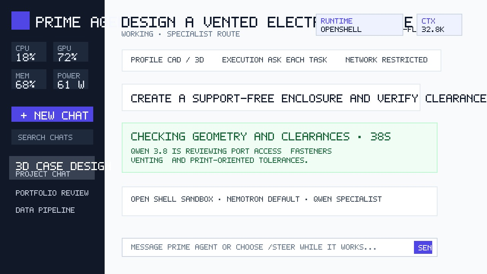

# Prime Agent WebUI

Prime Agent WebUI is a private, multi-user browser interface for
[Prime Agent](https://github.com/PrimeIntellect-ai/prime-agent). It adds durable
conversations, live progress and steering, file uploads, model/provider controls,
usage and spend summaries, Spark telemetry, administrative user management, and
release-aware updates.



> The screenshot contains synthetic sample data. No user conversations or
> credentials are included.

## Repository scope

This repository contains only the files needed to install, operate, validate,
and update Prime Agent WebUI and its service helpers. Production conversations,
system history, private operating notes, CAD projects, and locally refined agent
skills belong outside the repository and are excluded from version control.

## What this release includes

- Dedicated WebUI passwords with `admin`, `power_user`, and `user` roles; Linux
  passwords and PAM are not used.
- Private HTTPS through Nginx, secure cookies, CSRF/origin enforcement, rate and
  connection limits, and LAN/VPN source restrictions.
- Native Prime RPC conversations with immediate message echo, safe live progress,
  `/steer`, `/follow-up`, and explicit stop.
- Account-scoped collapsible projects and chats in the sidebar, with shared
  project instructions and uploaded sources, inherited conversation-control
  defaults, pinning, boxed `...` chat actions, and visible promotion of existing
  chats into new or existing projects.
- Persistent sandbox, tool, egress, proposal, and local-path controls directly
  below the conversation header; saved chats retain their own overrides.
- Configured-provider discovery, write-only credential forms, model selection,
  effort control, and provider/model token and spend roll-ups.
- Recoverable conversation deletion, isolated ownership metadata, uploads,
  activity logs, and administrative user lifecycle management.
- Production OpenShell per-task execution under a dedicated service identity,
  six immutable Docker profile images, isolated per-user storage, a
  credential/model gateway, four role-controlled network modes, and enforced
  resource limits.

## Supported systems

The WebUI and cloud/remote-model workflow supports current systemd-based members
of these families:

| Family | Examples | Package manager | Notes |
|---|---|---|---|
| Debian | Ubuntu 22.04/24.04, Debian 12 | `apt` | Primary and most-tested path. NVIDIA DGX Spark uses Ubuntu 24.04. |
| Red Hat | RHEL 9/10, Rocky, AlmaLinux, CentOS Stream, Fedora | `dnf`/`yum` | Enable the appropriate BaseOS/AppStream repositories. |
| SUSE | SLES 15, openSUSE Leap/Tumbleweed | `zypper` | The WebUI works; NVIDIA's DGX Spark local-model recipes are Ubuntu-specific. Package names can vary by service pack. |

Requirements: x86-64 or ARM64 Linux, systemd with user services, Python 3.10+,
Nginx, OpenSSL, curl, Git, sudo access during installation, and a private LAN or
VPN address. A local GPU is optional when cloud or remote OpenAI-compatible
providers are used.

## Quick installation

Clone the release and run the installer as the account that should own Prime:

```bash
git clone --branch v0.5.1 --depth 1 https://github.com/dmbyte/prime_agent_webui.git
cd prime_agent_webui
./install.sh --bind-address 192.168.1.50 --server-name prime.example.lan
```

For a private repository, authenticate Git or GitHub CLI before cloning. A
source archive can be used instead; preserve the repository directory layout.

Do **not** run `install.sh` as root. It asks for sudo only for OS packages,
private TLS, Nginx, and persistent user-service login. It then prompts for the
initial WebUI password; use at least 12 characters.

### Set the WebUI password

Prime WebUI does **not** authenticate with PAM, `/etc/shadow`, or a Linux account
password. The installer creates a separate salted password record and normally
runs the password tool automatically. The initial WebUI username defaults to the
name of the non-root account that ran the installer, but that name is only a
WebUI identifier—it does not enable system-account authentication.

If installation used `--skip-password`, or to rotate the password later, run
the installed tool as the WebUI owner without `sudo`:

```bash
~/.local/bin/prime-web-password
systemctl --user restart prime-auth.service
```

Enter and confirm a password of at least 12 characters at the masked prompts.
The tool stores only a salted scrypt record in
`~/.config/prime-agent/web-auth.json` with mode `0600`; it does not read or
change the Linux password. Then sign in at `https://ADDRESS:8443` using the
displayed WebUI username and the password you just set.

The installer deliberately does not modify the firewall. When it finishes, open
`https://ADDRESS:8443`, download `prime-webui-ca.crt`, and install that private CA
on each trusted client.

Useful options:

```text
--bind-address ADDRESS  Explicit private LAN/VPN address
--server-name NAME      Private DNS name for the certificate
--port PORT             HTTPS port; default 8443
--skip-packages         Packages are already installed
--skip-prime            Prime Agent is already installed
--skip-password         Set the password later with prime-web-password
```

## Distribution-specific preparation

The installer normally installs these automatically. Use the commands below when
you prefer to manage packages yourself, then add `--skip-packages`.

### Ubuntu and Debian

```bash
sudo apt-get update
sudo apt-get install -y nginx openssl python3 curl git
```

DGX Spark local Nemotron/Qwen hosting additionally requires NVIDIA's supported
Ubuntu image, driver/container stack, Docker, and the NVFP4 model artifacts. See
[the Spark deployment guide](deploy/spark/README.md); do not apply those GPU
steps to ordinary Ubuntu/Debian hosts.

### RHEL, Rocky, AlmaLinux, CentOS Stream, and Fedora

```bash
sudo dnf install -y nginx openssl python3 curl git policycoreutils-python-utils
```

On a minimal RHEL-compatible installation, enable the vendor-supported
BaseOS/AppStream repositories first.

When SELinux is enforcing, the installer enables `httpd_can_network_connect` so
Nginx can reach the loopback authentication and API services. This is not needed
on Debian-family systems.

### SLES and openSUSE

```bash
sudo zypper --non-interactive install nginx openssl python3 curl git
```

On SLES, enable the Server Applications and Containers modules appropriate to
your service pack. If a package uses a service-pack-specific name, install its
equivalent and use `--skip-packages`. DGX Spark's local NVFP4 recipes are not
supported on SLES; use cloud or a remote OpenAI-compatible inference endpoint.

### DGX Spark OpenShell and local models

The production Spark release runs Prime tasks inside NVIDIA OpenShell while
serving Nemotron 3.5 Lightning and Qwen 3.8 Flash-Next from loopback-only local
endpoints. Install the base WebUI first, then apply the Spark-specific model and
OpenShell pieces. On Ubuntu 24.04 DGX Spark systems, the extra host
prerequisites are Docker 28 or newer, `jq`, `acl`, and `rsync`.

Install Nemotron 3.5 Lightning on port 30000:

```bash
install -d ~/vllm-nemotron35
cp deploy/spark/vllm-nemotron35/vllm.env.template ~/vllm-nemotron35/vllm.env
cp deploy/spark/vllm-nemotron35/start.sh ~/vllm-nemotron35/start.sh
install -m 0644 deploy/spark/systemd/vllm-nemotron35.service ~/.config/systemd/user/
systemctl --user daemon-reload
systemctl --user enable --now vllm-nemotron35.service
curl -fsS http://127.0.0.1:30000/v1/models
```

If the model artifacts require Hugging Face access, add the token to
`~/vllm-nemotron35/vllm.env` before starting the service.

Install Qwen 3.8 Flash-Next on port 30001:

```bash
deploy/spark/llama-qwen38/build-image.sh
install -d ~/llama-qwen38
cp deploy/spark/llama-qwen38/llama.env.template ~/llama-qwen38/llama.env
cp deploy/spark/llama-qwen38/start.sh ~/llama-qwen38/start.sh
install -m 0644 deploy/spark/systemd/llama-qwen38.service ~/.config/systemd/user/
systemctl --user daemon-reload
systemctl --user enable --now llama-qwen38.service
curl -fsS http://127.0.0.1:30001/v1/models
```

Edit `~/llama-qwen38/llama.env` if the Qwen GGUF, multimodal projector, or MTP
draft files live outside the default model directory. Qwen 3.8 is the supported
Qwen runtime for this release.

Install the local model catalog and OpenShell integration:

```bash
install -m 0600 deploy/spark/prime/models.json ~/.prime/agent/models.json
install -m 0600 deploy/spark/prime/settings.json ~/.prime/agent/settings.json
deploy/spark/openshell/install.sh
systemctl --user restart prime-dashboard-api.service
deploy/spark/prime/validate.sh
```

The OpenShell installer uses the pinned ARM64 package, validates the published
checksum, provisions `prime-runner`, installs the model gateway and task broker,
copies existing owner state into protected runner storage, builds the approved
Docker runtime images, provisions per-user volumes, and restarts the local
gateway. See the component guides for details:
[Nemotron](deploy/spark/vllm-nemotron35/README.md),
[Qwen 3.8](deploy/spark/llama-qwen38/README.md), and
[OpenShell](deploy/spark/openshell/README.md).

## Firewall examples

Expose only the chosen HTTPS port to private LAN/VPN sources. Never expose the
backend ports 8764, 8765, 7681, 30000, or 30001.

Ubuntu with UFW:

```bash
sudo ufw allow from 192.168.0.0/16 to any port 8443 proto tcp
```

RHEL/SLES with firewalld (adjust the source range):

```bash
sudo firewall-cmd --permanent --new-zone=prime-private
sudo firewall-cmd --permanent --zone=prime-private --add-source=192.168.0.0/16
sudo firewall-cmd --permanent --zone=prime-private --add-port=8443/tcp
sudo firewall-cmd --reload
```

The supplied Nginx configuration independently allows loopback, RFC1918, and
`100.64.0.0/10` sources and denies public source addresses.

## First use

1. Sign in with the WebUI username created during installation (initially the
   installer account's name) and the dedicated password set by
   `prime-web-password`. This is not PAM or Linux-password authentication.
2. Open **Settings → Add provider** to configure an API-key or custom
   OpenAI-compatible provider. Secrets are accepted write-only and are never
   returned to the browser.
3. Alternatively run `prime-agent`, enter `/login`, and configure a supported
   subscription provider such as ChatGPT/Codex.
4. Choose a model and effort level. Start a conversation and approve or deny
   shell/code execution when prompted.
5. Administrators can add users and assign `user`, `power_user`, or `admin` from
   the Admin panel.

For a DGX Spark, use the tracked Nemotron and Qwen configurations under
`deploy/spark/`; both local endpoints must remain loopback-only.

## Operations

```bash
systemctl --user status prime-auth prime-dashboard-api
systemctl --user restart prime-auth prime-dashboard-api
journalctl --user -u prime-dashboard-api -f
systemctl status prime-model-gateway prime-runner-broker
prime-web-password
```

Nginx and certificate checks:

```bash
sudo nginx -t
sudo systemctl status nginx
curl -kI https://127.0.0.1:8443/login.html
```

Configuration and data live under:

- `~/prime-dgx-dashboard/` — installed WebUI application
- `~/prime-dgx-agent/` — workspace and uploads
- `~/.prime/agent/` — Prime sessions/settings and WebUI metadata
- `~/.config/prime-agent/web-auth.json` — mode-0600 password records
- `/var/lib/prime-runner/users/USER/` — isolated Prime state and workspace
- `/var/lib/prime-runner/credentials/` — protected global/per-user gateway credentials
- `/var/lib/prime-runner/image-digests.json` — approved immutable profile images
- `/var/www/prime-agent/` — static browser assets
- `/etc/nginx/prime-agent-{ca,tls}/` — private CA and server certificate

Back up the three user directories and the Nginx TLS/configuration before an
upgrade. Never commit credentials, provider settings, sessions, or TLS keys.

## Updating

Administrators can check and install published releases from Settings. Prime
Agent updates use the official versioned artifact and verify its published
SHA256SUMS entry. The WebUI updater resolves an immutable GitHub release tag.
OpenShell appears in the same section and updates only from NVIDIA's latest
stable ARM64 release with the published checksum file, while refusing to run if
OpenShell sandboxes still exist. In-app release checks require an authenticated
[GitHub CLI](https://cli.github.com/) installation because this repository is
private; core chat operation does not require `gh`.

For a manual upgrade:

```bash
git fetch --tags origin
git checkout v0.5.1
./install.sh --skip-packages --skip-prime --skip-password \
  --bind-address 192.168.1.50 --server-name prime.example.lan
```

## Security and limitations

Read the [security hardening guide](deploy/spark/security/README.md),
[OpenShell runtime-image guide](deploy/spark/container/README.md), and
[OpenShell operations guide](deploy/spark/openshell/README.md). In v0.5.1,
Prime tasks execute inside OpenShell sandboxes launched by the dedicated
`prime-runner` service identity, with separate per-user state/workspaces and no
host credentials. The API retains no-new-privileges, the gateway is loopback-only
with mTLS, and full-network mode remains intentionally powerful and limited to
confirmed power-user/administrator tasks.

This project provides research and workflow tooling, not investment advice or an
unattended live-trading system. Keep broker credentials and deterministic risk
controls outside model processes.

## Development and verification

```bash
python3 -m unittest discover -s deploy/spark/dashboard -p 'test*.py' -v
node --check deploy/spark/dashboard/app-v2.js
bash -n install.sh deploy/spark/update/update-prime-agent.sh \
  deploy/spark/update/update-webui.sh deploy/spark/update/update-openshell.sh
```

Run `./scripts/validate-release.sh` before publishing a change. Keep operational
history, private system notes, CAD projects, and specialized agent skills outside
the deployable WebUI repository.

## License

No license has been selected yet. Until one is added, the repository remains
all-rights-reserved by its owner.
