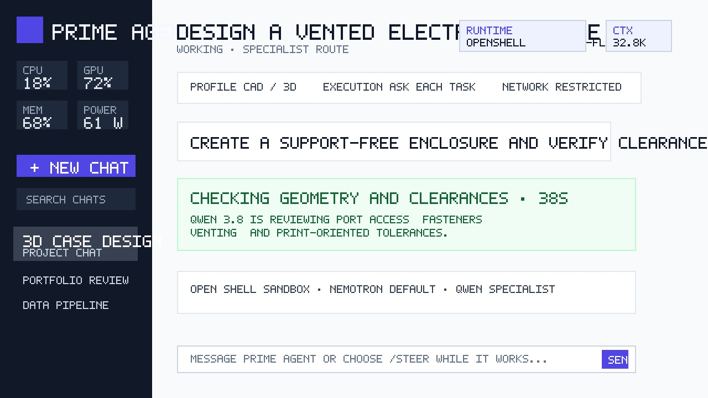

# Prime Agent WebUI

Prime Agent WebUI is a private, multi-user browser interface for
[Prime Agent](https://github.com/PrimeIntellect-ai/prime-agent). It adds durable
conversations, live progress and steering, file uploads, model/provider controls,
usage and spend summaries, Spark telemetry, administrative user management, and
release-aware updates.

This is the **`only-qwen38flash` branch**: Qwen 3.8 Flash-Next handles both
routine orchestration and implementation using different reasoning-effort
settings on one resident model. Nemotron is disabled, not deleted, on migrated
systems. This branch includes changes after `v0.5.47`; it is not a new release
tag and does not change `main`.



> The screenshot contains synthetic sample data. No user conversations or
> credentials are included.

## Repository scope

This repository contains only the files needed to install, operate, validate,
and update Prime Agent WebUI and its service helpers. Production conversations,
system history, private operating notes, CAD projects, and locally refined agent
skills belong outside the repository and are excluded from version control.

## Why one Qwen model instead of two local models?

The previous deployment split routine orchestration onto Nemotron 3.5 Lightning
and implementation/visual work onto Qwen. Both engines competed for the Spark's
shared memory. This branch uses the **same Qwen weights** for both roles:
WebUI **Auto** chooses low effort for routine requests and high effort for
detected coding or complex work. High effort maps to the server's `xhigh`;
it is not a second model instance. See the [exact routing rules](docs/model-routing.md).

| Area | Previous dual-model configuration | This Qwen-only configuration |
|---|---|---|
| Resident local inference engines | Nemotron and Qwen | Qwen only; Nemotron artifacts retained for rollback |
| Qwen context budget | 98,304 tokens in one slot | 262,144 tokens in one slot: about 2.67× the budget |
| Qwen K/V cache | Q4 | Q8; model weights remain IQ4_XS |
| Routine vs complex work | Model selection and inter-model handoff | Low vs high effort on the same engine |
| Nontrivial code | Must route away from Nemotron to Qwen | Qwen is already the default and remains mandatory for code |
| Local concurrency | Separate engines can execute different work concurrently | One model slot; requests share/queue for that slot |

The practical advantages are:

- **More memory for Qwen and tools.** Removing the second resident engine makes
  room for the larger context and Q8 cache while retaining a tested system-memory
  reserve. This is one engine's cache, not a cache shared between models.
- **More conversation and source material before compaction.** The larger Qwen
  budget helps longer coding, browser and console workflows. The total includes
  prompt **and** output; Prime still reserves 8,192 output tokens and compacts
  long histories. It is not unlimited task memory.
- **Less cache quantization.** Q8 stores K/V at higher precision than Q4. It uses
  more memory; we have not established a general accuracy improvement or
  tokens-per-second increase from that change alone.
- **Fewer inter-model handoffs and running inference services.** Routine and
  coding tasks use the same local provider and model behavior. Explicit cloud
  routes and bounded high-effort child tasks remain available, but a second local
  engine no longer needs to be kept running for orchestration.
- **Effort matched to the task.** Low effort can reduce time spent generating
  reasoning on simple requests; high effort is selected for demanding work.
  Effort is not a hard time/token cap or a guarantee of correctness.

### What the tests establish—and what they do not

On the reference Spark, a **249,943-token** chat recovered an early marker
correctly, with **36.12 GiB minimum available RAM** during that test. Short
synthetic arithmetic measured about **40–41 decode tokens/s**; near the context
limit it measured **12.38 tokens/s**, with approximately **871 seconds total**
including prompt processing. A later prompt-switch check reached a minimum of
**35.62 GiB available (29.28%)**, still above the configured 15% reserve.

These are recorded single-slot results, **not a controlled speed or accuracy
comparison against the dual-model setup**. Larger context costs latency;
disabling Nemotron does not itself make every Qwen token faster. One engine
also removes the independent second inference slot and makes Qwen a single
local-model dependency. Keep the dual-model configuration as a deliberate
rollback option if independent local concurrency matters more than Qwen's larger
context. Do not re-enable both at the enlarged settings without revalidating RAM.

## What this branch includes

- Qwen-only defaults, automatic low/high effort, 256K context and Q8 K/V cache.
- A read-only console viewer for browser/KVM/SOL observations, and renewable
  task deadlines with an explicit **Extend 30 minutes** prompt.
- Managed LAN ISO/file and application hosting with external-to-container URLs,
  task/project discovery, expiry and restart recovery.

- Dedicated WebUI passwords with `admin`, `power_user`, and `user` roles; Linux
  passwords and PAM are not used.
- Private HTTPS through Nginx, secure cookies, CSRF/origin enforcement, rate and
  connection limits, LAN/VPN source restrictions, and durable login sessions
  with a 30-day idle window and 180-day maximum lifetime.
- Native Prime RPC conversations with immediate message echo, safe live progress,
  `/steer`, `/follow-up`, and explicit stop.
- Account-scoped collapsible projects and chats in the sidebar, with shared
  project instructions and uploaded sources, inherited conversation-control
  defaults, pinning, boxed `...` chat actions, and visible promotion of existing
  chats into new or existing projects.
- Persistent sandbox, tool, egress, proposal, local-path, and security-prompt
  controls directly below the conversation header; saved chats retain their own
  overrides. **Always allow for this chat/project** suppresses repeated prompts
  only while the requested policy exactly matches that saved scope.
- Configured-provider discovery, write-only credential forms, model selection,
  effort control, and provider/model token and spend roll-ups.
- One-second CPU, GPU, memory, power, and temperature sparklines at the top of
  the sidebar, with large value watermarks and an expanded live hover view.
  Hovering or keyboard-focusing the memory graph also shows used and
  free/available RAM amounts (`G` denotes GiB in the narrow card).
- Recoverable conversation deletion, isolated ownership metadata, uploads,
  activity logs, and administrative user lifecycle management.
- Production OpenShell per-task execution under a dedicated service identity,
  six immutable Docker profile images, isolated per-user storage, a
  credential/model gateway, four role-controlled network modes, and enforced
  resource limits.

## Supported systems

The WebUI and cloud/remote-model workflow supports current systemd-based members
of these families:

| Family | Examples | Package manager | Notes |
|---|---|---|---|
| Debian | Ubuntu 22.04/24.04, Debian 12 | `apt` | Primary and most-tested path. NVIDIA DGX Spark uses Ubuntu 24.04. |
| Red Hat | RHEL 9/10, Rocky, AlmaLinux, CentOS Stream, Fedora | `dnf`/`yum` | Enable the appropriate BaseOS/AppStream repositories. |
| SUSE | SLES 15, openSUSE Leap/Tumbleweed | `zypper` | The WebUI works; NVIDIA's DGX Spark local-model recipes are Ubuntu-specific. Package names can vary by service pack. |

Requirements: x86-64 or ARM64 Linux, systemd with user services, Python 3.10+,
Nginx, OpenSSL, curl, Git, sudo access during installation, and a private LAN or
VPN address. A local GPU is optional when cloud or remote OpenAI-compatible
providers are used.

## Quick installation

Clone this branch and run the installer as the account that should own Prime:

```bash
git clone --branch only-qwen38flash --single-branch https://github.com/dmbyte/prime_agent_webui.git
cd prime_agent_webui
./install.sh --bind-address 192.168.1.50 --server-name prime.example.lan
```

For a private repository, authenticate Git or GitHub CLI before cloning. A
source archive can be used instead; preserve the repository directory layout.

This installs the base WebUI, not the local model weights or GPU runtime.
Continue with [the Spark setup](#dgx-spark-openshell-and-local-models) for local
Qwen and OpenShell. Do not use the release-only WebUI update button to track
this branch; see [branch updates](#updating).

Do **not** run `install.sh` as root. It asks for sudo only for OS packages,
private TLS, Nginx, and persistent user-service login. It then prompts for the
initial WebUI password; use at least 12 characters.

### Set the WebUI password

Prime WebUI does **not** authenticate with PAM, `/etc/shadow`, or a Linux account
password. The installer creates a separate salted password record and normally
runs the password tool automatically. The initial WebUI username defaults to the
name of the non-root account that ran the installer, but that name is only a
WebUI identifier—it does not enable system-account authentication.

If installation used `--skip-password`, or to rotate the password later, run
the installed tool as the WebUI owner without `sudo`:

```bash
~/.local/bin/prime-web-password
systemctl --user restart prime-auth.service
```

Enter and confirm a password of at least 12 characters at the masked prompts.
The tool stores only a salted scrypt record in
`~/.config/prime-agent/web-auth.json` with mode `0600`; it does not read or
change the Linux password. Then sign in at `https://ADDRESS:8443` using the
displayed WebUI username and the password you just set.

The installer deliberately does not modify the firewall. When it finishes, open
`https://ADDRESS:8443`, download `prime-webui-ca.crt`, and install that private CA
on each trusted client.

Useful options:

```text
--bind-address ADDRESS  Explicit private LAN/VPN address
--server-name NAME      Private DNS name for the certificate
--port PORT             HTTPS port; default 8443
--skip-packages         Packages are already installed
--skip-prime            Prime Agent is already installed
--skip-password         Set the password later with prime-web-password
```

## Distribution-specific preparation

The installer normally installs these automatically. Use the commands below when
you prefer to manage packages yourself, then add `--skip-packages`.

### Ubuntu and Debian

```bash
sudo apt-get update
sudo apt-get install -y nginx openssl python3 curl git
```

DGX Spark local Qwen hosting additionally requires NVIDIA's supported
Ubuntu image, driver/container stack, Docker, and the IQ4_XS GGUF artifacts. See
[the Spark deployment guide](deploy/spark/README.md); do not apply those GPU
steps to ordinary Ubuntu/Debian hosts.

### RHEL, Rocky, AlmaLinux, CentOS Stream, and Fedora

```bash
sudo dnf install -y nginx openssl python3 curl git policycoreutils-python-utils
```

On a minimal RHEL-compatible installation, enable the vendor-supported
BaseOS/AppStream repositories first.

When SELinux is enforcing, the installer enables `httpd_can_network_connect` so
Nginx can reach the loopback authentication and API services. This is not needed
on Debian-family systems.

### SLES and openSUSE

```bash
sudo zypper --non-interactive install nginx openssl python3 curl git
```

On SLES, enable the Server Applications and Containers modules appropriate to
your service pack. If a package uses a service-pack-specific name, install its
equivalent and use `--skip-packages`. DGX Spark's local GPU recipes are not
supported on SLES; use cloud or a remote OpenAI-compatible inference endpoint.

### DGX Spark OpenShell and local models

Use `only-qwen38flash` for this profile; the `v0.5.47` tag still has the earlier
dual-model defaults. No published release tag has been moved. New installations
do not need Nemotron; existing installations retain its files for rollback.

The current Spark recipe runs Prime tasks inside NVIDIA OpenShell with
Qwen 3.8 Flash-Next as the default local model on a loopback-only endpoint.
Nemotron 3.5 Lightning is retained but disabled to free memory for Qwen's
256K context and Q8 cache. Install the base WebUI first, then apply the model and
OpenShell pieces. On Ubuntu 24.04 DGX Spark systems, the extra host
prerequisites are Docker 28 or newer, `jq`, `acl`, and `rsync`.

Before building Qwen, stage all three IQ4_XS GGUF shards, the vision projector
and the shared-Q8 MTP head on NVMe. The build script also requires a clean,
pre-existing reviewed llama.cpp checkout at its pinned revision; it does not
clone that checkout or download weights. These external artifacts are not
distributed by this repository. See the [Qwen build prerequisites](deploy/spark/llama-qwen38/README.md#build-and-install)
before running the commands. Ordinary disk swap is not a substitute for the
model-specific NVMe PLE loading path.

Fresh installations: install Qwen 3.8 Flash-Next on port 30001. Existing
dual-model installations must use the migration below instead of starting
the enlarged Qwen configuration with Nemotron still running:

```bash
deploy/spark/llama-qwen38/build-image.sh
install -d ~/llama-qwen38
cp deploy/spark/llama-qwen38/llama.env.template ~/llama-qwen38/llama.env
# Set MODEL_DIR in llama.env to your staged model directory before continuing.
cp deploy/spark/llama-qwen38/start.sh ~/llama-qwen38/start.sh
install -m 0644 deploy/spark/systemd/llama-qwen38.service ~/.config/systemd/user/
systemctl --user daemon-reload
systemctl --user enable --now llama-qwen38.service
curl -fsS http://127.0.0.1:30001/v1/models
```

Edit `~/llama-qwen38/llama.env` if the Qwen GGUF, multimodal projector, or MTP
draft files live outside the default model directory. Qwen 3.8 is the supported
Qwen runtime for this branch.

For an existing dual-model installation, stop and disable Nemotron **without
deleting it**, and disable Docker's independent restart policy before restarting
Qwen with the updated environment. Back up `~/llama-qwen38/llama.env` and `start.sh` first;
preserve custom model paths when changing `CONTEXT_SIZE=262144`, both cache types
to `q8_0`, and `REASONING_EFFORT=low`. Install the updated `start.sh` as well.

```bash
systemctl --user disable --now vllm-nemotron35.service
docker update --restart=no vllm-nemotron35
systemctl --user restart llama-qwen38.service
python3 deploy/spark/prime/configure-qwen-only.py
```

The migration backs up existing model/settings files and preserves unrelated
providers and existing manual chat effort choices. Do not overwrite an existing
installation's settings with the fresh-install copies below. Refresh OpenShell's
protected runner and dashboard using the installer/update workflow. No model
weights, stopped containers, or conversations are deleted. To roll back, first
restore the saved Qwen environment/start script and restart Qwen; then restore
Prime settings, enable Nemotron and its Docker restart policy. Do not simply
start both engines at the enlarged context without checking the 15% RAM reserve.

For a **fresh installation only**, install the local model catalog/defaults:

```bash
install -m 0600 deploy/spark/prime/models.json ~/.prime/agent/models.json
install -m 0600 deploy/spark/prime/settings.json ~/.prime/agent/settings.json
```

For an existing installation use `configure-qwen-only.py` above instead, to
preserve unrelated providers and settings. Then, for either installation path,
install OpenShell and skills while tasks/KVM/hosting services are stopped:

```bash
deploy/spark/openshell/install.sh
deploy/spark/prime/install-skills.sh
systemctl --user restart prime-dashboard-api.service
deploy/spark/prime/validate.sh
```

The OpenShell installer uses the pinned ARM64 package, validates the published
checksum, provisions `prime-runner`, installs the model gateway and task broker,
copies existing owner state into protected runner storage, builds the approved
Docker runtime images, provisions per-user volumes, and restarts the local
gateway. It installs the reviewed BMC and hosting skills; the following skill installer
pins the official NVIDIA catalog at commit
`fd9f1466ff8a39178e488981e8b5118709392949`. See the component guides for details:
[Nemotron](deploy/spark/vllm-nemotron35/README.md),
[Qwen 3.8](deploy/spark/llama-qwen38/README.md), and
[OpenShell](deploy/spark/openshell/README.md).

### Deployed DGX Spark configuration

The tracked Spark recipe is intentionally explicit. A default deployment uses
these concrete parameters unless you edit the copied files under your home
directory before starting the services.

<details>
<summary>Retained Nemotron configuration — rollback reference, not active</summary>

This records the older co-resident configuration, not a recommendation to start
Nemotron alongside the current enlarged Qwen profile.

Source files:
`deploy/spark/vllm-nemotron35/vllm.env.template`,
`deploy/spark/vllm-nemotron35/start.sh`, and
`deploy/spark/systemd/vllm-nemotron35.service`.

| Setting | Deployed value |
|---|---|
| Container image | `vllm/vllm-openai:v0.27.1-aarch64-cu129-ubuntu2404` |
| Model | `nvidia/NVIDIA-Nemotron-3.5-Lightning-30B-A3B-NVFP4` |
| DSpark draft model | `nvidia/NVIDIA-Nemotron-3.5-Lightning-30B-A3B-NVFP4-DSpark` |
| Served name | `nemotron-3.5-lightning` |
| Listener | `127.0.0.1:30000` |
| Context cap | `MAX_MODEL_LEN=262144` |
| GPU memory target | `GPU_MEMORY_UTILIZATION=0.30` |
| Explicit KV cache | `KV_CACHE_MEMORY_BYTES=2G` |
| Parallel sequences | `MAX_NUM_SEQS=2` |
| Speculation | `SPEC_TOKENS=3`, `--spec-method dspark` |
| Container memory | `--memory=68g`, `--memory-swap=80g`, `--shm-size=24g` |

In the previous validation, vLLM reported 505,783 cache tokens from the fixed 2 GiB
FP8 KV pool. One 262,144-token request leaves 243,639 cache tokens for other
work, but two full-length requests (524,288 tokens) still cannot run
concurrently. The two-sequence scheduler can serve a second shorter request.
The context limit includes prompt and generated tokens. A 30% GPU
startup target was required in that earlier co-resident configuration; its
35% target failed the then-current startup free-memory check. This is historical
evidence, not a validation against today's enlarged Qwen cache.

The vLLM command line includes:

```text
--moe-backend marlin
--kv-cache-dtype fp8
--enable-prefix-caching
--spec-method dspark
--spec-model nvidia/NVIDIA-Nemotron-3.5-Lightning-30B-A3B-NVFP4-DSpark
--spec-tokens 3
--mamba-backend flashinfer
--mamba-cache-mode align
--reasoning-parser nemotron_v3
--tool-call-parser qwen3_coder
--enable-auto-tool-choice
--max-model-len 262144
--gpu-memory-utilization 0.30
--kv-cache-memory-bytes 2G
--max-num-seqs 2
--served-model-name nemotron-3.5-lightning
```

</details>

#### Qwen 3.8 Flash-Next service

Source files:
`deploy/spark/llama-qwen38/llama.env.template`,
`deploy/spark/llama-qwen38/start.sh`, and
`deploy/spark/systemd/llama-qwen38.service`.

| Setting | Deployed value |
|---|---|
| Container image | `local/llama-qwen38-mtp:560abb66` |
| Model directory | `/home/dbyte/models/qwen38-flash-next-ud-iq4-xs` |
| Main GGUF | `UD-IQ4_XS/Qwen3.8-Flash-Next-UD-IQ4_XS-00001-of-00003.gguf` |
| Vision projector | `mmproj-F16.gguf` |
| MTP draft head | `MTP/mtp-Qwen3.8-Flash-Next-shared-Q8_0.gguf` |
| Served name | `qwen3.8-flash-next` |
| Listener | `127.0.0.1:30001` |
| Context slot | `CONTEXT_SIZE=262144` |
| Parallel slots | `PARALLEL=1` |
| GPU layers | `GPU_LAYERS=999` and `SPEC_DRAFT_GPU_LAYERS=999` |
| KV cache | `CACHE_TYPE_K=q8_0`, `CACHE_TYPE_V=q8_0` |
| Default effort | `REASONING_EFFORT=low`; per-request high maps to `xhigh` |
| Batching | `BATCH_SIZE=2048`, `UBATCH_SIZE=512` |
| PLE loading | `--load-mode mmap`, `LAZY_MODE=on-direct` |
| Speculation | `SPEC_DRAFT_MAX_TOKENS=2`, `SPEC_DRAFT_P_MIN=0.0` |
| Container memory | `--memory=88g`, `--memory-swap=88g` |

The llama.cpp server command line includes:

```text
--model /models/UD-IQ4_XS/Qwen3.8-Flash-Next-UD-IQ4_XS-00001-of-00003.gguf
--mmproj /models/mmproj-F16.gguf
--model-draft /models/MTP/mtp-Qwen3.8-Flash-Next-shared-Q8_0.gguf
--spec-type draft-mtp
--spec-draft-ngl 999
--spec-draft-n-max 2
--spec-draft-p-min 0.0
--alias qwen3.8-flash-next
--ctx-size 262144
--parallel 1
--gpu-layers 999
--flash-attn on
--cache-type-k q8_0
--cache-type-v q8_0
--batch-size 2048
--ubatch-size 512
--load-mode mmap
--lazy-mode on-direct
--reasoning auto
--reasoning-effort low
--reasoning-format deepseek
--metrics
```

Q8 applies to the K/V cache, not the model weights: IQ4_XS weights and shared-Q8
MTP are unchanged. Keep `PARALLEL=1` and Prime compaction enabled. Context is a
total input/output budget, not 262,144 input tokens plus an output allowance.
After deployment run `validate-qwen-context.py --long` from `deploy/spark/prime`
on the Spark with no active tasks; it checks both effort modes, near-limit recall
and the 15% available-RAM reserve. Long prompts take longer to prefill and decode;
do not transfer short-context throughput numbers to full-context work.

Reference validation of this Qwen-only profile: a 249,943-token chat recovered
an early marker correctly, with minimum available RAM 36.12 GiB (29.69%). It
took 871 seconds overall and decoded at 12.38 token/s; short arithmetic checks
measured roughly 40–41 token/s. This is a synthetic single-slot result, not an
accuracy or capacity guarantee for arbitrary workloads. Both real OpenShell
low-effort response and high-effort Python/assertion tests returned final reports.
After switching back to short requests, retained prompt cache left 36.28 GiB
available (35.62 GiB transient minimum, 29.28%); the 15% reserve still passed.

#### OpenShell task runtime

Source files:
`deploy/spark/openshell/install.sh`,
`deploy/spark/openshell/provision-volumes.sh`,
`deploy/spark/container/openshell_runner.py`,
`deploy/spark/container/runner_launch.py`, and
`deploy/spark/systemd/prime-runner-broker.service`. Long-running HTML5 KVM
also uses `deploy/spark/container/kvm_broker.py` and
`deploy/spark/systemd/prime-kvm-broker.service`.

| Setting | Deployed value |
|---|---|
| OpenShell package | `0.1.2-1` ARM64 `.deb`, SHA256 `14838b811b54148060da99fd2aabe78f05c777002c0a8fc39b106e0de0ddd796` |
| Gateway name | `spark-local` |
| Gateway | schema v2, Docker driver, loopback `127.0.0.1:17670`, mTLS, telemetry off |
| Docker attachment policy | `allow_driver_config=true`, resource admission enabled, approved Prime volumes labeled attachable for workspace `default` |
| Task service identity | `prime-runner:prime-runner` |
| Supplementary groups | `prime-web`, `prime-local-access` |
| Dashboard runtime env | `PRIME_TASK_RUNTIME=openshell` |
| Runner state root | `/var/lib/prime-runner/users` |
| Task workspace root | `/home/WEB_OWNER/prime-agent/tasks` |
| Sandbox workdir | `/project` |
| Default task limits | `memoryGiB=8`, `cpus=4`, `runtimeMinutes=30` |
| Prime daemon socket | `/tmp/prime-daemon-<task-prefix>.sock` per task |
| Prime RPC FIFO | `/tmp/prime-rpc-<task-prefix>.fifo` per task |

If a task appears stuck, expand its in-chat task trace. It reports the last
OpenShell startup/tool stage and how many seconds have passed since runtime
output. Right-click the trace or choose **Complete output…** for the
owner-scoped, live-updating redacted log; use **Download** to retain a copy.
The activity panel shows a short recent preview; **Complete output…** loads the
full log separately. The output view refreshes every three seconds. Private
reasoning and recognized credentials are hidden; events above the 262 KiB
runtime safety limit are not retained. A silent tool call may still require
waiting for the task deadline or explicitly stopping that task. Tasks start with
a 30-minute deadline by default. Five minutes before expiry, the WebUI shows a
nonmodal warning with **Extend 30 minutes** and **Keep deadline**. Each confirmed
extension adds 30 minutes to the existing deadline without restarting the task;
the warning returns five minutes before the new deadline. Without a response
(including a closed browser), the task stops on time and the chat explains why.
Saved conversation/workspace/logs remain available; a follow-up starts a new task,
not a resurrection of the expired process. Extensions are owner-only, protected
by the normal login/CSRF checks, and duplicate requests add time only once.
Existing role ceilings remain: standard users 30 minutes (no extension), power
users 120 minutes total, administrators 240 minutes total. The sandbox retains an
independent role-ceiling cutoff; the API enforces the shorter approved deadline.
Install the WebUI and protected OpenShell runner together while tasks are idle.

Each OpenShell sandbox is created with these important switches:

```text
openshell --gateway spark-local sandbox create
  --name pt-<task-prefix>
  --from local/prime-openshell-<profile>:0.9.5-<digest>
  --policy /var/lib/prime-runner/openshell-policies/<task>.yaml
  --driver-config-json <pre-provisioned Docker volume mounts>
  --cpu <task cpus>
  --memory <task memory>Gi
  --approval-mode manual|auto
  --label prime.owner=<user>
  --label prime.profile=<profile>
  --label prime.network=<restricted|internet|lan|full>
  --label prime.task=<task-id>
  --detach
  --no-auto-providers
  --no-tty
  -- /bin/sleep infinity
```

Prime is then executed inside the sandbox with:

```text
timeout --signal=TERM --kill-after=15s <runtime>m
openshell --gateway spark-local sandbox exec
  --name pt-<task-prefix>
  --workdir /project
  --no-tty
  --env HOME=/home/prime
  --env NO_PROXY=127.0.0.1,localhost,::1
  --env no_proxy=127.0.0.1,localhost,::1
  --env TINI_SUBREAPER=1
  --env PATH=/home/prime/.prime/tools/npm/bin:/project/.venv/bin:/usr/local/bin:/usr/bin:/bin
  --env XDG_CACHE_HOME=/home/prime/.prime/cache
  --env UV_CACHE_DIR=/home/prime/.prime/cache/uv
  --env PIP_CACHE_DIR=/home/prime/.prime/cache/pip
  --env NPM_CONFIG_CACHE=/home/prime/.prime/cache/npm
  --env NPM_CONFIG_PREFIX=/home/prime/.prime/tools/npm
  --env PLAYWRIGHT_BROWSERS_PATH=/home/prime/.prime/tools/playwright
  --env PRIME_AGENT_KERNEL_PYTHON=/opt/prime-kernel/bin/python
  --env IPYTHONDIR=/home/prime/.prime/ipython
  -- /usr/local/bin/prime-container-entrypoint
     --cwd /project
     --mode rpc
     --daemon-socket /tmp/prime-daemon-<task-prefix>.sock
     --provider <selected provider>
     --model <selected model>
     --thinking <selected effort>
```

When execution mode is **Deny tools**, the runner also passes `--no-tools`.
Existing conversations add either `--resume SESSION_ID` or `--fork SESSION_ID`.

The default OpenShell filesystem policy makes these paths read-only:

```text
/usr
/lib
/proc
/etc
/opt/prime-kernel
/run/prime-gateway
/home/prime/.prime/agent/project-sources
/project-files/<approved-source>
```

and only these paths writable:

```text
/home/prime/.prime
/project
/tmp
/dev/null
/dev/urandom
/dev/random
/dev/shm
```

The device entries are granted when the sandbox is created. Chromium's TLS
runtime reads the kernel random devices and uses shared memory; because
OpenShell confinement is monotonic, adding these paths to an already-running
sandbox cannot repair a browser process that started without them.

The sandbox receives Docker bind volumes only through pre-provisioned local
volumes:

| Volume | Sandbox path | Mode |
|---|---|---|
| `prime-USER-prime` | `/home/prime/.prime` | read/write |
| `prime-USER-workspace` | `/project` | read/write |
| `prime-USER-gateway-MODE` | `/run/prime-gateway` | read-only |
| `prime-shared-mnt`, `prime-shared-media`, `prime-shared-srv`, `prime-shared-opt` | `/project-files/...` | read-only, explicitly approved paths only |

The local-path picker still rejects arbitrary `/home` paths. The controlled
`~/prime-agent/tasks/USER/` workspace is the only home-backed writeable task
mount in the default Spark recipe.

### Skills and additional tools

Installed skills live at `/home/prime/.prime/agent/skills` inside a task and in
the protected per-user Prime volume on the host. For compatibility with agents
that write beneath the work directory, `/project/.prime/agent/skills` is linked
to the same registry. Existing workspace-only skills are copied into the
registry and retained in a timestamped recovery directory during migration.

The WebUI provides a governed **Skills & tools** workflow:

1. A user opens **Settings → Skills & tools**, chooses **Request skill**, and
   uploads a ZIP containing exactly one `SKILL.md` at the archive root or inside
   one top-level directory. The request declares intended access, project
   dependencies, and any required system tools.
2. An administrator reviews the request under **Admin → Skills & tools**. The UI
   exposes the requesting account, scope, archive SHA-256, requested access,
   dependencies, and system tools before approval.
3. Approval safely validates and unpacks instruction skills into the requesting
   user's host-visible `~/prime-agent/tasks/USER/.prime/agent/skills/` registry.
   Existing same-name installs are moved to recovery storage. Approval never
   executes package managers or grants root.
4. An approved skill can be enabled for a project in **Project settings →
   Project skills**. New project chats receive that selection as shared context.
   Administrators can later disable, re-enable, deny, or recoverably remove it.

Requests for operating-system tools enter the `Sandbox image change required`
state. They must be added to a reviewed, rebuilt, digest-pinned OpenShell image;
the dashboard does not install them into a live task. Python/npm dependencies
remain explicit review data and are installed only through the normal
non-root project-environment workflow below.

The images include pip, uv, and npm. Use a persistent project environment for
additional Python packages:

```bash
uv venv /project/.venv
uv pip install --python /project/.venv/bin/python PACKAGE
```

Select **Internet** for tasks that must download packages. Caches and user-level
npm/Playwright content persist under `/home/prime/.prime`; `/usr` remains
read-only and tasks do not receive sudo. System binaries must be added to a
reviewed image profile. The `network-operations` profile includes Chromium and
ipmitool for browser-assisted BMC and IPMI work.

The supported Spark bundle includes Prime-native `bmc-headless-browser`,
`bmc-html5-kvm`, and `ipmi-redfish-bmc` packages. The bounded page-action
browser adapter runs Playwright and the
profile's existing Chromium in a clean, per-browser subprocess so Prime's
persistent IPython event loop cannot retain Playwright connection state. The
private pipe bridge uses worker threads instead of IPython's asyncio subprocess
child watcher, keeping consecutive launches reliable after cancellation. Each
operation has a bounded timeout and captures worker diagnostics. Both adapters require explicit confirmation before any
power-changing action. Credentials are supplied only at runtime. Prime sees the
short skill metadata for routing, but imports these adapters only after a task
selects them. Playwright is present only in the `network-operations` image and
starts only when the BMC browser is opened.

The separate `bmc-html5-kvm` skill keeps an HTML5 console in a dedicated,
owner-scoped OpenShell sandbox across Prime tasks. It requires the
`network-operations` profile with **LAN/VPN or Full network** mode. The launcher
mounts the owner's KVM control channel at `/run/prime-kvm` and sets
`PRIME_KVM_SOCKET=/run/prime-kvm/kvm.sock` for those combinations. The KVM worker
itself retains LAN egress. Two sessions are allowed per owner. List existing
sessions first and connect by session ID. Repeated creation at the same BMC
origin and TLS setting reuses that session without reloading it; Redfish API URLs
are rejected as non-console targets. Inspect
on-demand PNG/JPEG frames before sending confirmed keyboard, mouse, or form input.
`capture('console.png')` saves below `/project`. `inspect()` lists visible controls,
login-page presence, and frame indexes without exposing form values.
`inspect()['consoleSurfaces']` gives each visible canvas/video's `frameIndex` and
`selector`. Embedded consoles use `select_frame(surface['frameIndex'])`; do not
guess frame 0 or assume a second browser tab exists.
Normal query-string routes and initial same-host HTTP-to-HTTPS redirects are
supported. Console keys/text require a focused, visible canvas/video surface;
use `focus_console(selector, confirm=True)` after inspecting the console. A login
page, mounted media, or consumed boot override is not evidence that an installer
booted. Cross-origin frames and redirects remain blocked.
Sessions expire after 45 minutes idle or eight hours total, and do not survive
a broker restart, host reboot, or BMC idle timeout. The initial target
is HPE iLO 5; a live iLO console remains to be validated. The BMC account
needs Remote Console privilege, the feature enabled, and a supporting license.
The skill does not automate virtual media or guarantee an uninterrupted install;
keep the iLO session and media lifecycle under operator review.

Use **Console viewer ↗** beside the conversation title to open a separate,
read-only window showing the agent's browser or HTML5 KVM page. Select a source,
pause/resume the view, or switch between fit-to-window and actual size. A visible
viewer requests frames about once per second; hidden/closed viewers stop requesting
new frames. Closing the viewer never closes the agent's browser or KVM session,
and viewing does not extend KVM's idle timeout. Frame age and stale/busy/closed
states distinguish live output from an old image. New console sources appear
automatically in an already-open viewer; browsers require a user click to open
the popout initially.

SOL feeds show the agent's last rendered `read()` result when the adapter is used
with a supported direct-IPMI transport; the viewer does **not** enable SOL in the
current OpenShell HTTP-only deployment. Console feeds are isolated by authenticated
owner, contain only the latest bounded image/text (not a video recording), and
never accept keyboard/mouse input. Closed feeds clear their pixels/text; abrupt
task exits show stale output, which stops being served after one hour. Runtime
snapshots live in `/project/.prime-console` (the owner's host task workspace),
not in chat logs or Git. Treat visible console contents as sensitive.

The package also contains an interactive IPMI Serial-over-LAN adapter, but
**direct IPMI/SOL is not available through the deployed OpenShell HTTP(S)
gateway**, including Full mode. It now fails fast with that explanation;
use Redfish or HTML5 KVM instead. In a separately authorized environment with
direct IPMI transport, the adapter uses `lanplus`, a private pseudo-terminal,
and a bounded ANSI/VT100 screen renderer for BIOS and boot text. Inspect
`sol_info()` first; then use `with bmc.sol_session() as sol:` to read the screen.
Sending a key or text requires authorization for the exact target and action
and `confirm=True`. HPE firmware must have its Virtual Serial Port and BIOS
serial-console redirection configured, and the booting installer or OS must
output to serial. SOL does not display graphical KVM. The browser skill
does not provide a persistent HTML5 KVM controller; use the separate KVM
skill for a longer session, subject to the bounds above.
See the bundled skills' `SKILL.md` files for the bounded API and safety rules.

Task model and HTTP proxy connections use the bounded loopback relay packaged
at `/usr/local/lib/prime-gateway-relay.py`, on ports 31000 and 31080 respectively.
A rejected or cancelled connection does not terminate its listener. Egress
still passes through the selected owner gateway Unix socket; this does not
enable direct networking. Network-operations tasks also receive short runtime
instructions on correct IPython/browser use, session reuse, and transport limits.
The managed KVM instructions are at
`/home/prime/.prime/agent/skills/bmc-html5-kvm/SKILL.md` inside tasks. Run
`deploy/spark/prime/validate-prime-kvm-task.py` as the WebUI owner for a full
local-model/runner/IPython/KVM fixture test; it makes a synthetic test conversation
and fails on unexpected tool errors, absent final reports, or missing fixture
evidence. It uses the production routing decision and does not contact a real BMC.

Code generation belongs to Qwen in **all six profiles**. The WebUI routes
recognized coding/automation requests and Development/Network operations tasks
to `spark-qwen/qwen3.8-flash-next`, retains that route on coding follow-ups, and
shows the selected model and reason in the conversation controls. This policy
takes precedence over model directives/custom keyword rules for code work;
if Qwen is disabled, the task reports a blocker instead of using Nemotron.
Ordinary non-code conversations now use Qwen at low effort in Auto mode;
coding and complex operations use high effort. Nemotron is disabled, not removed.
The managed workspace policy and per-task instructions require nontrivial work
discovered during low-effort execution to be delegated with
`rlm.spawn(..., model="spark-qwen/qwen3.8-flash-next", thinking="high")`.
Intent routing is deterministic for the covered requests; delegation of newly
discovered subtasks is an agent instruction, not a Python-level execution lock.
No model choice expands permissions or authorizes BMC actions.
See [model routing rules](docs/model-routing.md) for precedence, default trigger
phrases, continuation behavior, and administrator configuration.

`deploy/spark/prime/install-skills.sh` also validates and stores all 366 upstream
NVIDIA skills unchanged in protected global Prime state. Prime advertises one
`prime-nvidia-catalog` router and loads only a selected skill on demand;
directly advertising every entry would consume roughly 13,000 tokens before
each task. Catalog instructions do not override OpenShell access, role,
confirmation, or immutable-image boundaries. Re-running the installer is
recoverable. To use an already-reviewed checkout without another clone:

```bash
deploy/spark/prime/install-skills.sh --nvidia-source /path/to/NVIDIA-skills
```

The installer publishes a metadata-only, owner-scoped skill inventory for the
WebUI. In a project, open **Project settings → Project skills** and search the
installed Prime and NVIDIA entries. Selecting a catalog skill gives Prime its
on-demand path without loading the entire catalog into every prompt. New skill
archives still require administrator review. An older install can refresh just
the inventory with `install-managed-skills.py --inventory-only` for its owner.

OpenShell updates require zero existing sandboxes, including idle ones. The
WebUI reports this blocker. Review and finish a sandbox's work before removing
it; an update never deletes sandboxes automatically. A newer upstream release
must also match Prime's reviewed installer pin before the update is applied,
so a later WebUI reinstall cannot silently downgrade the package. OpenShell
0.0.x to 0.1.x is a breaking migration, not a one-click update; the backup,
gateway schema conversion, client re-registration, and Docker volume-label
procedure is in the [OpenShell operations guide](deploy/spark/openshell/README.md).

## Firewall examples

Expose only the chosen HTTPS port to private LAN/VPN sources. Never expose the
backend ports 8764, 8765, 7681, 30000, or 30001.

Ubuntu with UFW:

```bash
sudo ufw allow from 192.168.0.0/16 to any port 8443 proto tcp
```

RHEL/SLES with firewalld (adjust the source range):

```bash
sudo firewall-cmd --permanent --new-zone=prime-private
sudo firewall-cmd --permanent --zone=prime-private --add-source=192.168.0.0/16
sudo firewall-cmd --permanent --zone=prime-private --add-port=8443/tcp
sudo firewall-cmd --reload
```

The supplied Nginx configuration independently allows loopback, RFC1918, and
`100.64.0.0/10` sources and denies public source addresses.

## First use

1. Sign in with the WebUI username created during installation (initially the
   installer account's name) and the dedicated password set by
   `prime-web-password`. This is not PAM or Linux-password authentication.
2. Open **Settings → Add provider** to configure an API-key or custom
   OpenAI-compatible provider. Secrets are accepted write-only and are never
   returned to the browser.
3. Alternatively run `prime-agent`, enter `/login`, and configure a supported
   subscription provider such as ChatGPT/Codex.
4. Choose a model and effort level. Under **Security prompts**, keep **Ask each
   task** or choose **Always allow for this chat**. Project settings offer the
   equivalent project default; a new standalone chat asks once before saving it.
5. Administrators can add users and assign `user`, `power_user`, or `admin` from
   the Admin panel.

For a DGX Spark on this branch, select Qwen and Auto effort. Qwen's endpoint
must remain loopback-only; retained Nemotron remains disabled.

## Operations

```bash
systemctl --user status prime-auth prime-dashboard-api
systemctl --user restart prime-auth prime-dashboard-api
journalctl --user -u prime-dashboard-api -f
systemctl status prime-model-gateway prime-runner-broker prime-kvm-broker prime-hosting-broker
prime-web-password
```

Nginx and certificate checks:

```bash
sudo nginx -t
sudo systemctl status nginx
curl -kI https://127.0.0.1:8443/login.html
```

Configuration and data live under:

- `~/prime-dgx-dashboard/` — installed WebUI application
- `~/prime-dgx-agent/` — legacy host-mode workspace and uploads
- `~/prime-agent/tasks/USER/` — host-visible OpenShell task workspace mounted
  as `/project`
- `~/.prime/agent/` — Prime sessions/settings and WebUI metadata
- `~/.config/prime-agent/web-auth.json` — mode-0600 password records
- `~/.config/prime-agent/web-sessions.json` — mode-0600 durable WebUI sessions
- `/var/lib/prime-runner/users/USER/` — isolated Prime state
- `/var/lib/prime-runner/credentials/` — protected global/per-user gateway credentials
- `/var/lib/prime-runner/openshell-image-digests.json` — approved immutable profile images
- `/var/www/prime-agent/` — static browser assets
- `/etc/nginx/prime-agent-{ca,tls}/` — private CA and server certificate

Back up the configuration/state directories above, including the host task
workspace and protected runner state, plus Nginx TLS/configuration before an
upgrade. Never commit credentials, provider settings, sessions, or TLS keys.

## Updating

**Stay on this branch deliberately.** The Settings WebUI updater follows the
latest GitHub **release tag**, not `only-qwen38flash`. Using it on this branch
can select the older release and lose the branch's installed behavior. Use the
manual branch workflow below until a release explicitly includes these changes.
The UI version remains the base `0.5.47`; use the branch and Git commit to
identify this build, not that version alone. No new release is implied.

Administrators can check and install published releases from Settings. Prime
Agent updates use the official versioned artifact and verify its published
SHA256SUMS entry. The OpenShell task images pin that same Prime version and
checksum; a WebUI update rebuilds and verifies all six task profiles so host and
sandbox APIs cannot drift. The managed task-workspace `AGENTS.md` explicitly
uses Prime 0.9.5's `rlm.spawn` API with the exact
`spark-qwen/qwen3.8-flash-next` selector and runs `agent_message.send` only
inside `ipython`. An older managed policy is backed up before replacement;
unrelated custom policies are left untouched. The immutable kernel installs and
import-verifies every Python-backed skill bundled with the pinned Prime release,
including agent messaging and observation. The WebUI updater resolves an
immutable GitHub release tag.
OpenShell appears in the same section and updates only from NVIDIA's latest
stable ARM64 release with the published checksum file, while refusing to run if
OpenShell sandboxes still exist. In-app release checks require an authenticated
[GitHub CLI](https://cli.github.com/) installation because this repository is
public, but the current updater uses authenticated GitHub CLI requests to avoid
anonymous API limits; core chat operation does not require `gh`.

Selecting **Admin** replaces the chat pane with a wider administration
workspace. **OpenShell sandboxes** checks every workspace and displays the
associated Prime task, saved status, and whether a WebUI task is actually
active. An administrator may stop and delete a reviewed, inactive Prime task
sandbox only after typing its exact name. The server checks again for active
tasks and non-idle sandbox processes; it never cleans sandboxes automatically.
Task logs, conversations, and the host task workspace are retained. Deleting
a sandbox can still discard sandbox-local state, so inspect it first.

For a manual upgrade of a clean, branch-tracking checkout (back up configuration
and data first; preserve any local edits instead of resetting them):

```bash
git fetch origin only-qwen38flash
git switch only-qwen38flash
git merge --ff-only origin/only-qwen38flash
./install.sh --skip-packages --skip-prime --skip-password \
  --bind-address 192.168.1.50 --server-name prime.example.lan
```

For an existing OpenShell deployment, also apply the runtime update (with no
active Prime tasks, KVM consoles or managed hosting services), then refresh managed skills:

```bash
deploy/spark/openshell/install.sh
deploy/spark/prime/install-skills.sh --bundled-only
```

This rebuilds/verifies all six immutable images, refreshes the privileged
helpers and managed workspace policy, and activates the OpenShell task runtime.
Do not treat a static WebUI copy alone as a completed runtime upgrade. The
in-app WebUI updater performs this OpenShell step automatically. Existing custom
workspace policies are preserved; per-task model routing guidance still applies.

Validate the installed runtime as the WebUI owner:

```bash
bash scripts/validate-release.sh
python3 deploy/spark/prime/validate-prime-kvm-task.py
```

The model-driven check needs the local Qwen service and the installed owner KVM
broker. It runs only against a synthetic local BMC, retains a diagnostic test
conversation, and closes its fixture session. Set `PRIME_KVM_TEST_HOST` to the
Spark's private IP if it is not the recipe default. It does not verify a real
BMC login, console license, or server boot.

## Security and limitations

### Managed LAN web hosting

Prime's installed `lan-web-host` skill publishes selected ISO/files or a web app
from a dedicated OpenShell container and returns the **Spark's LAN IP and port**,
not a container address. Use LAN/Full network access with tools enabled. Related
tasks can discover project-scoped services; hosting survives task completion,
defaults to 24 hours, and supports renew/stop controls. Static hosting supports
HTTP byte ranges for BMC virtual media. Only deliberately staged content under
`/project/hosted/` is published. URLs are unauthenticated HTTP on the LAN, not
automatic Internet exposure. Four services maximum, 2 CPUs/1 GiB each, host ports
18080–18111. No model services need to be restarted.

See the [LAN hosting guide](docs/lan-web-hosting.md) for exact container parameters,
Python/Node app configuration, shared-service discovery, address selection,
firewall requirements, administrator controls and reproducible network tests.

### Runtime boundaries

Read the [security hardening guide](deploy/spark/security/README.md),
[OpenShell runtime-image guide](deploy/spark/container/README.md), and
[OpenShell operations guide](deploy/spark/openshell/README.md). In v0.5.14,
Prime tasks execute inside OpenShell sandboxes launched by the dedicated
`prime-runner` service identity, with protected per-user Prime state and a
host-visible task workspace under `~/prime-agent/tasks/USER/`. That workspace is
mounted as `/project` inside the sandbox; credentials, sessions, the Docker
socket, and arbitrary home-directory paths are not mounted. Each task also uses
its own sandbox-local Prime control socket so stale OpenShell worker records
cannot poison later resumes. The API retains no-new-privileges, the gateway is
loopback-only with mTLS, and full-network mode remains intentionally powerful
and limited to confirmed power-user/administrator tasks.

The **Always allow** setting is owner-scoped and stored with the chat or project,
not as a global bypass. The API honors it only when the sandbox image, execution
mode, network mode, policy-proposal mode, and local paths exactly match the saved
policy. Changing any of those controls requires the new policy to be saved in
that scope. Role restrictions, OpenShell isolation, resource limits, and the
read-only treatment of approved host paths remain enforced.

WebUI logins remain valid for up to 30 days without activity and 180 days total,
and survive `prime-auth.service` or WebUI updates through the private
mode-0600 session store. Explicit sign-out, password rotation, administrator
revocation, account disablement/deletion, idle expiry, and absolute expiry all
invalidate access. A v0.5.14 upgrade restarts the authentication service once,
so the first deployment may require one final sign-in before durable sessions
take effect.

This project provides research and workflow tooling, not investment advice or an
unattended live-trading system. Keep broker credentials and deterministic risk
controls outside model processes.

## Development and verification

```bash
python3 -m unittest discover -s deploy/spark/dashboard -p 'test*.py' -v
node --check deploy/spark/dashboard/app-v2.js
bash -n install.sh deploy/spark/update/update-prime-agent.sh \
  deploy/spark/update/update-webui.sh deploy/spark/update/update-openshell.sh
```

Run `./scripts/validate-release.sh` before publishing a change. Keep operational
history, private system notes, CAD projects, and specialized agent skills outside
the deployable WebUI repository.

## License

No license has been selected yet. Until one is added, the repository remains
all-rights-reserved by its owner.
